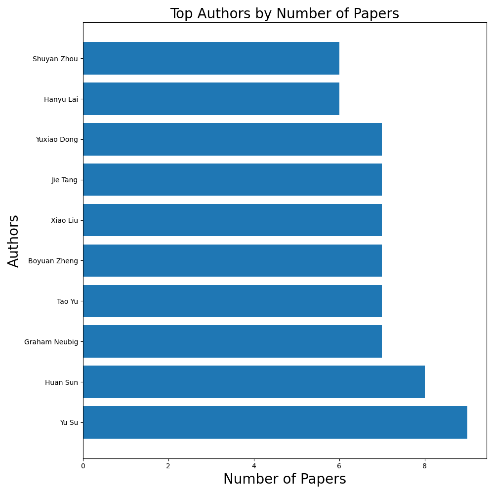

# Awesome GUI Agent Paper List

This repo covers a variety of papers related to GUI Agents, such as:
- GUI Understanding
- Datasets
- Benchmarks
- New frameworks
- New models
- Vision, language, multimodal foundation models (with explicit support for GUI)
- Works in general domains extensively used by GUI Agents (e.g., SoM prompting)


[//]: # (<div style="display: flex; justify-content: space-around;">)

[//]: # (  )

[//]: # (  )

[//]: # (</div>)


## Papers Grouped by Environments
| [Web](paper_by_env/paper_web.md) | [Mobile](paper_by_env/paper_mobile.md) | [Desktop](paper_by_env/paper_desktop.md) | [GUI](paper_by_env/paper_gui.md) | [Misc](paper_by_env/paper_misc.md) |
|--------------------------------|---------------------------------------|------------------------------------------|----------------------------------|------------------------------------|

(Misc: Papers that do not specifically study for GUIs.)

## Papers Grouped by Keywords
[Model](paper_by_key/paper_model.md) | [Framework](paper_by_key/paper_framework.md) | [Dataset](paper_by_key/paper_dataset.md) | [Benchmark](paper_by_key/paper_benchmark.md) | [Safety](paper_by_key/paper_safety.md) | [Survey](paper_by_key/paper_survey.md) | 
[UI understanding](paper_by_key/paper_UI%20understanding.md) | [Attack](paper_by_key/paper_attack.md) | [Evaluation](paper_by_key/paper_evaluation.md) | [Foundation model](paper_by_key/paper_foundation%20model.md) | [Grounding](paper_by_key/paper_grounding.md) | [Learning](paper_by_key/paper_learning.md) | [Planning](paper_by_key/paper_planning.md) | [Programming-by-demonstration](paper_by_key/paper_programming-by-demonstration.md) | [Reasoning](paper_by_key/paper_reasoning.md) | [Reinforcement learning](paper_by_key/paper_reinforcement%20learning.md) | [Self-improvement](paper_by_key/paper_self-improvement.md) | [Synthetic data](paper_by_key/paper_synthetic%20data.md) | [Vision language model](paper_by_key/paper_vision%20language%20model.md) | [Visual grounding](paper_by_key/paper_visual%20grounding.md)

## Papers Grouped by Authors
[Boyuan Zheng](paper_by_author/paper_Boyuan_Zheng.md) | [Daniel Fried](paper_by_author/paper_Daniel_Fried.md) | [Difei Gao](paper_by_author/paper_Difei_Gao.md) | [Graham Neubig](paper_by_author/paper_Graham_Neubig.md) | [Hanyu Lai](paper_by_author/paper_Hanyu_Lai.md) | [Huan Sun](paper_by_author/paper_Huan_Sun.md) | [Jie Tang](paper_by_author/paper_Jie_Tang.md) | [Mike Zheng Shou](paper_by_author/paper_Mike_Zheng_Shou.md) | [Shuyan Zhou](paper_by_author/paper_Shuyan_Zhou.md) | [Tao Yu](paper_by_author/paper_Tao_Yu.md) | [Tianbao Xie](paper_by_author/paper_Tianbao_Xie.md) | [Xiao Liu](paper_by_author/paper_Xiao_Liu.md) | [Yu Su](paper_by_author/paper_Yu_Su.md) | [Yuxiao Dong](paper_by_author/paper_Yuxiao_Dong.md) | [Zhiyong Wu](paper_by_author/paper_Zhiyong_Wu.md)

## All Papers (from most recent to oldest)
<details open>
<summary>Papers</summary>

{{insert_all_papers_here}}

</details>


## How to Add a Paper or Update the README

Please fork and update:
- [paper list](update_template_or_data/update_paper_list.md)
- [README template](update_template_or_data/update_readme_template.md)
- [automatic workflow](.github/workflows/main.yml)

You can use [this GPTs](https://chatgpt.com/g/g-VqW9ONrgL-gui-paper-list) to quickly search and get a formatted paper entry automatically.
<details>
<summary>format example and explanation</summary>

```
- [title](paper link)
    - List authors directly without a "key" identifier (e.g., author1, author2)
    - 🏛️ Institutions: List the institutions concisely, using abbreviations (e.g., university names, like OSU).
    - 📅 Date: e.g., Oct 30, 2024
    - 📑 Publisher: ICLR 2025
    - 💻 Env: Indicate the research environment within brackets, such as [Web], [Mobile], or [Desktop]. Use [GUI] if the research spans multiple environments. Use [General] if it is researching on general domains.
    - 🔑 Key: Label each keyword within brackets, e.g., [model], [framework],[dataset],[benchmark].
    - 📖 TLDR: Brief summary of the paper.
```

Regarding the 🔑 Key: 

| Key             | Definition                                                                            |
|-----------------|---------------------------------------------------------------------------------------|
| model           | Indicates a newly trained model.                                                      |
| framework       | If the paper proposes a new agent framework.                                          |
| dataset         | If a new (training) dataset is created and published.                                 |
| benchmark       | If a new benchmark is established (also add "dataset" if there's a new training set). |
| primary studies | List the main focus or innovation in the study.                                       |
| Abbreviations | Include commonly used abbreviations associated with the paper (model names, framework names, etc.).                       |

For missing information, use "Unknown."


</details>


## Contributors

<a href="https://github.com/OSU-NLP-Group/GUI-Agents-Paper-List/graphs/contributors">
  
</a>
